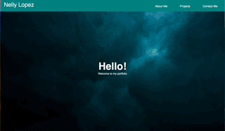

# Portfolio
## Description

Welcome to my mock-up portfolio designed for potential hiring managers. Crafting this web-based portfolio aims to simplify the process for hiring managers to explore my professional background. The digital format not only facilitates seamless navigation but also allows for direct links to my various projects.

**Key Features**:

* About Me: Discover insights into my background and professional journey.
* Work/Projects: Dive into a showcase of my notable projects and accomplishments.
* Contact Information: Find convenient ways to get in touch with me.

**Design Philosophy**: 
My objective in developing this site was to strike a balance between readability and a unique representation of my personal style. Through this project, I gained valuable experience in creating responsive websites and mastering the utilization of flexbox for optimal design.

Feel free to explore, and thank you for considering my portfolio!

**Link to Portfolio**: https://nlopez39.github.io/Portfolio/

## Demo



## Installation
Follow these steps to set up and run the project locally on your machine.

### Clone the Repository

1. Open your terminal or command prompt.

2. Navigate to the directory where you want to store the project:

    ```bash
    cd path/to/your/directory
    ```

3. Clone the repository:

    ```bash
    git clone git@github.com:nlopez39/portfolio.git
    ```

### Install Dependencies

1. Navigate to the project directory:

    ```bash
    cd your-project
    ```

2. Install project dependencies:

    ```bash
    npm install
    ```

### Run the Project
Once the installation is complete, you can run the project:
    ```bash
    npm start
    ```


## Usage
### Prerequisites

Before getting started, ensure you have the following prerequisites installed:

- Web Browser: To view and interact with the portfolio.
- Code Editor: Optionally, for those who wish to explore or modify the source code.

### View the Portfolio
1. Clone the repository to your local machine:

    ```bash
    git clone git@github.com:nlopez39/portfolio.git
    ```

2. Navigate to the project directory:

    ```bash
    cd your-portfolio
    ```

3. Open the `index.html` file in your preferred web browser.

### Explore the Source Code
If you want to explore or modify the source code, follow these steps:

1. Open the project in your preferred code editor.

2. Navigate through the project structure to find HTML, CSS, or other relevant files.

3. Make desired changes and save the files.

4. Refresh the `index.html` file in your web browser to see the updated portfolio.

### Customize Your Portfolio
Feel free to customize the content to better reflect your personal and professional information:

- Update the "About Me" section in the `index.html` file.
- Add or remove projects in the `projects` directory.
- Modify the styles in the `styles` directory to match your

## Credits

* https://www.makeuseof.com/responsive-navigation-bar-using-html-and-css/
* https://www.w3schools.com/howto/howto_css_hero_image.asp
* https://unsplash.com/s/photos/portfolio-background
* https://www.freecodecamp.org/news/how-to-create-a-portfolio-website-using-html-css-javascript-and-bootstrap/#how-to-add-a-navigation-menu-to-your-portfolio 
* https://writersblocklive.com/blog/how-to-turn-an-image-into-a-url-link/:

## License

Please refer to the LICENSE in the repository


